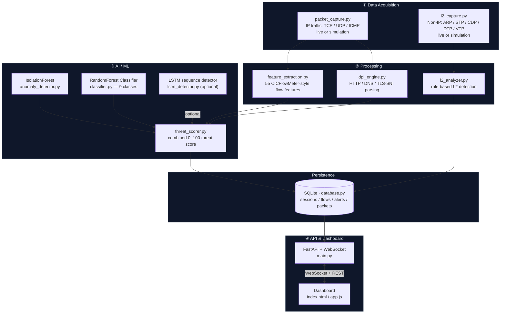
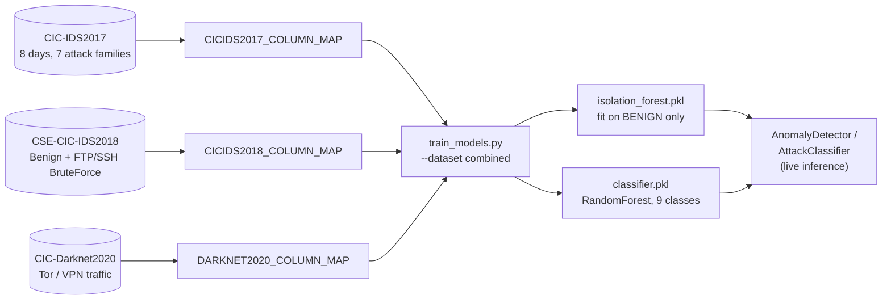

# Aegis-AI

**Intelligent Network Behavior Analysis System** — real-time packet capture, ML-based threat classification, deep packet inspection, and Layer-2 attack detection, behind a live WebSocket dashboard.

> SRS v1.0 compliant · local VM / Docker deployment

## Table of Contents

- [Features](#features)
- [Quick Start](#quick-start)
- [Architecture](#architecture)
- [ML Models](#ml-models)
- [Project Structure](#project-structure)
- [Deployment / VM Lab](#deployment--vm-lab)
- [Engineering Notes](#engineering-notes)

---

## Features

- Real-time packet capture (live via scapy, or built-in traffic simulator)
- Deep Packet Inspection: real HTTP/DNS/TLS-SNI parsing, not port-guessing
- IsolationForest anomaly detection + RandomForest attack classification
- LSTM sequence analysis (optional, needs TensorFlow — see `requirements-optional.txt`; `ThreatScorer` automatically redistributes its scoring weight when it's not installed/trained, so this is genuinely optional, not silently broken)
- Combined 0–100 threat score with risk levels
- **Layer 2 monitoring**: ARP spoofing, MAC flooding, STP/CDP/DTP/VTP attacks, VLAN hopping
- **Tor/VPN traffic detection** (`TOR_VPN` class, trained on CIC-Darknet2020)
- Live WebSocket dashboard: threat gauge, attack distribution, flow table, alert feed, top talkers
- Session-based "Clear All" — archives instead of deletes, browsable via `/api/sessions`
- Alert export (JSON/CSV), API-key auth, rate limiting
- Docker containerization

---

## Quick Start

```bash
chmod +x run.sh
./run.sh
```
This trains the ML models on synthetic data if `models/` is empty, then starts the server with an auto-generated API key printed to the console. Set `AEGIS_API_KEY` beforehand to pin a stable key across restarts. Models trained on real data (see [ML Models](#ml-models)) are already included in this repo — `run.sh` won't overwrite them.

> **Note on repo size:** this repo bundles the actual training datasets (`data/raw_datasets/`, ~330MB compressed) so the "trained on real data" claim is independently verifiable rather than taken on trust. If you're cloning just to run the app, you don't need to touch that folder; it's only relevant if you want to verify or reproduce training.

### Manual setup
```bash
pip install -r requirements.txt

export AEGIS_API_KEY=$(python -c "import secrets; print(secrets.token_urlsafe(32))")

python src/api/main.py
```
Open **http://localhost:8000** — the dashboard reads the injected API key automatically.

### Docker
```bash
docker-compose up --build
# or: docker run -e AEGIS_API_KEY=$(openssl rand -hex 32) -p 8000:8000 aegis-ai
```

### Tests
```bash
pip install -r requirements.txt  # includes pytest/httpx
pytest tests/ -v
```

---

## Architecture



### The L2 sidecar

The core 4-layer pipeline only sees IP traffic, so it's blind to Layer-2 attack tooling (e.g. **Yersinia**) that forges frames with no IP header at all. The **L2 sidecar** runs in parallel with rule-based (not ML) detection, since those attacks have no "flow" to compute statistics over:

| Attack | Detected by |
|---|---|
| ARP spoofing / cache poisoning | conflicting IP→MAC bindings across ARP replies |
| MAC flooding (CAM table overflow) | burst of unseen source MACs in a short window |
| STP root bridge hijack | a new BPDU claiming a superior (lower) bridge ID |
| STP topology-change flood | repeated forced topology-change BPDUs |
| CDP flood | abnormal rate of Cisco Discovery Protocol frames |
| DTP switch spoofing | any DTP trunk-negotiation frame from an end host |
| VTP configuration attack | a suspicious jump in VTP revision number |
| VLAN hopping | frames carrying two stacked 802.1Q tags |

L2 alerts flow through the same alert pipeline, database, WebSocket feed, and dashboard as regular alerts (tagged `layer: "L2"`) — same panel, distinct **L2** badge. Filter via `/api/alerts?layer=L2`; check `/api/l2/status` for the analyzer's live internal state. Like the main pipeline, `config.l2.mode` is `simulation` or `live` (real capture via scapy, requires root/raw-socket access).

### ML training pipeline



Three independently-published datasets, each with its own CICFlowMeter column-naming convention, are explicitly remapped (not fuzzy-matched — see [Engineering Notes](#engineering-notes)) onto the exact 55-feature schema the live app computes from packets, then merged into one shared 9-class taxonomy.

---

## ML Models

The models in `models/` are trained on **243,028 real, labeled flows** combined from three independent public datasets — not synthetic data. The datasets themselves are bundled in the repo (`data/raw_datasets/`, compressed originals, ~330MB) specifically so this claim doesn't have to be taken on trust — see [`data/TRAINING_PROVENANCE.md`](data/TRAINING_PROVENANCE.md) for SHA-256 checksums of every archive and every extracted CSV, the exact training command used, and instructions to reproduce it yourself.

| Dataset | Rows used (capped 15K/class) | Contributes |
|---|---|---|
| [CIC-IDS2017](https://www.unb.ca/cic/datasets/ids-2017.html) | ~199K | BENIGN, DoS, DDoS, PortScan, BruteForce, WebAttack, Bot, Infiltration |
| [CSE-CIC-IDS2018](https://www.unb.ca/cic/datasets/ids-2018.html) | ~29K | BENIGN, BruteForce (FTP/SSH) |
| [CIC-Darknet2020](https://www.unb.ca/cic/datasets/darknet2020.html) | 15K | BENIGN, **TOR_VPN** (new class) |

**9-class taxonomy:** `BENIGN`, `DoS`, `DDoS`, `PortScan`, `BruteForce`, `WebAttack`, `Bot`, `Infiltration`, `TOR_VPN`.

**Held-out test-set results** (20% split, stratified, 48,606 rows): **98.44% overall accuracy**.

| Class | Precision | Recall | F1 | Support |
|---|---|---|---|---|
| BENIGN | 1.00 | 0.98 | 0.99 | 30,000 |
| Bot | 0.56 | 0.99 | 0.72 | 393 |
| BruteForce | 1.00 | 1.00 | 1.00 | 5,767 |
| DDoS | 1.00 | 1.00 | 1.00 | 3,000 |
| DoS | 0.95 | 1.00 | 0.97 | 3,000 |
| Infiltration | 1.00 | 0.50 | 0.67 | 10 |
| PortScan | 1.00 | 1.00 | 1.00 | 3,000 |
| TOR_VPN | 0.94 | 0.99 | 0.97 | 3,000 |
| WebAttack | 0.92 | 0.98 | 0.95 | 436 |

**Bot's low precision and Infiltration's reduced recall are data-scarcity artifacts, not bugs** — the source datasets contain only ~2K real Bot rows and 36 real Infiltration rows combined, across hundreds of thousands of BENIGN rows, so this is what genuine real-world attack-class imbalance looks like when reported honestly rather than hidden. Treat a `Bot` verdict as a lower-confidence signal, not a verdict; `Infiltration`/`WebAttack` would benefit most from more real-world data if this is retrained with a higher `--max-per-class`.

The IsolationForest is fit on **BENIGN-only** flows (`contamination=0.01`) so it learns an actual baseline of normal traffic instead of treating a large slice of attack traffic as "normal". Both models are trained on **raw, unscaled** features to match exactly what `AnomalyDetector`/`AttackClassifier` feed them at inference time (see [Engineering Notes](#engineering-notes)).

**Known limitation:** all three datasets are lab-captured traffic (2017–2020), not this project's own network. They validate the ML *plumbing* end-to-end and give a real, honestly-measured baseline — not a guarantee these thresholds are correct for a specific production network. Re-validate false-positive rate against real deployment traffic before trusting alerts unattended.

### Reproducing this training run

```bash
bash scripts/prepare_datasets.sh   # verifies checksums, then extracts the bundled archives
python scripts/train_models.py --dataset combined \
  --csv-dir data/cicids2017 \
  --cicids2018-csv data/cicids2018/cic.csv \
  --darknet-csv data/darknet2020/Darknet.CSV \
  --max-per-class 15000 --skip-lstm
```
Full provenance, checksums, and exact reported numbers: [`data/TRAINING_PROVENANCE.md`](data/TRAINING_PROVENANCE.md).

### Retraining with different parameters

```bash
python scripts/train_models.py --dataset combined \
  --csv-dir /path/to/cicids2017-day-csvs/ \
  --cicids2018-csv /path/to/cicids2018.csv \
  --darknet-csv /path/to/darknet2020.csv \
  --max-per-class 60000
```
Any of `--csv-dir` / `--cicids2018-dir` / `--cicids2018-csv` / `--darknet-dir` / `--darknet-csv` can be omitted or combined freely — the script trains on whatever subset you provide. `--max-per-class 0` disables capping (uses every row; much slower on a single core, and the full-file reads are chunked internally specifically so this doesn't exhaust memory on a constrained host — see [Engineering Notes](#engineering-notes)). Add new datasets by writing a `COLUMN_MAP` dict + a `categorize_*` label function, following the pattern of the three already in `scripts/train_models.py`.

---

## Project Structure

```
Aegis-AI/
├── config/
│   └── config.yaml
├── data/
│   ├── aegis.db                # SQLite DB, created at runtime
│   ├── raw_datasets/            # bundled original dataset archives (see below)
│   └── TRAINING_PROVENANCE.md   # checksums + exact command to verify/reproduce training
├── models/                    # trained .pkl artifacts (included)
│   ├── isolation_forest.pkl
│   ├── classifier.pkl
│   ├── classifier_scaler.pkl  # saved for reference, not used at inference
│   ├── scaler.pkl             # (same)
│   └── label_encoder.pkl
├── src/
│   ├── capture/                 # packet_capture.py, l2_capture.py
│   ├── processing/               # feature_extraction.py, dpi_engine.py, l2_analyzer.py, scan_detector.py
│   ├── ml/                       # anomaly_detector.py, classifier.py, lstm_detector.py, threat_scorer.py
│   ├── core/                     # database.py, state.py, auth.py, rate_limit.py
│   ├── api/                      # main.py (FastAPI + WebSocket)
│   └── dashboard/                # index.html, js/app.js
├── scripts/
│   ├── train_models.py
│   ├── prepare_datasets.sh      # extracts data/raw_datasets/ into the layout train_models.py expects
│   └── generate_traffic.py
├── tests/                     # 57 pytest tests
├── docker-compose.yml
├── Dockerfile
├── requirements.txt
├── run.sh
└── README.md
```

---

## Deployment / VM Lab

Suggested 3-VM lab for exercising the live-capture path end-to-end:

- **VM1** — Aegis Engine (this system)
- **VM2** — Victim (Ubuntu 22.04)
- **VM3** — Attacker (Kali Linux)

Set `capture.mode: live` (and `l2.mode: live`) in `config.yaml` for real capture on VM deployment; both default to `simulation` otherwise.

---

## Engineering Notes

Chronological log of concrete bugs found and fixed while hardening this project, most recent first. Kept for anyone auditing what changed and why.

<details>
<summary><b>Datasets trained end-to-end and bundled in-repo for verification (243K real flows) — one checksum bug found while writing it up</b></summary>

Retrained the shipped models from scratch against the actual dataset archives, end-to-end on this machine, specifically so the training claim above isn't something you have to take on faith — `data/raw_datasets/` now ships the three original archives, and `data/TRAINING_PROVENANCE.md` records SHA-256 checksums for each archive and each extracted CSV plus the exact command used, so anyone can re-run it and compare.

Two things came up during this:
1. **The training script itself couldn't handle the memory-constrained host it was run on.** `load_flow_csv()` read each CSV fully into a `float64` DataFrame in one `pd.read_csv()` call; on a 1-CPU/3.9GB host this OOM-killed the process partway through the 135MB `Tuesday-WorkingHours.pcap` file, with no traceback (just a silently dead background process — caught by monitoring RSS over time, not by an error message). Fixed by switching to chunked reads (200K rows/chunk) with per-chunk `float32` downcasting and per-chunk class-capping, so peak memory is bounded by chunk size rather than file size. Re-ran successfully afterward (RSS stayed under ~560MB for the full combined run).
2. **Checksum mismatch caught by the verification script itself.** While writing `data/TRAINING_PROVENANCE.md`, the SHA-256 values for `CIC-Darknet2020.zip` and `CSE-CIC-IDS2018.zip` were transposed — a copy-paste ordering mistake, not a data problem. `scripts/prepare_datasets.sh` (written specifically to make this reproducible) caught its own documentation being wrong on first run (`MISMATCH` on two of three files) before any training happened. Fixed by recomputing and correctly re-mapping both hashes; `prepare_datasets.sh` now runs clean.

Resulting run: 243,028 samples (capped 15K/class for tractability on that host), 98.44% held-out accuracy — see [ML Models](#ml-models) for the full per-class report. `Bot` (0.56 precision) and `Infiltration` (0.50 recall on 10 test rows) remain the known weak points, unchanged in character from the previous training run — they're a data-scarcity artifact of the source datasets, not something introduced by this retrain.
</details>

<details>
<summary><b>Full remediation pass — 13 bugs fixed across capture, ML, L2, dashboard, and infra (57 tests, up from 35)</b></summary>

A full line-by-line audit of every file in `src/` (prompted by a direct question: "is the L2 sidecar real, and is this an excellent project") turned up 13 concrete bugs, all fixed and verified with an executed test or reproduction script, not just re-reading code:

- **Flow-assembly bug (the big one).** `PacketCapture.flows` was keyed by each packet's *literal* `(src_ip,dst_ip,src_port,dst_port,protocol)`, so a response packet (swapped src/dst/ports) could never land in the same bucket as its request — every flow was structurally one-directional, silently zeroing `total_bwd_packets`/`down_up_ratio` for every flow ever produced. Worse: flows only reached the ML/DPI pipeline once they had `>=2` packets, so single-packet flows (a lone scan probe, one DNS query) just expired unseen 60s later. Measured impact before the fix: 0–29% of packets in each simulated attack scenario ever reached detection (port scan and slow-APT scenarios: **0%**). Fixed with a canonical (direction-independent) flow key plus idle-timeout-based finalization; now **100%** across every scenario.
- **Stored XSS chained with default wildcard CORS.** DPI-parsed, attacker-controlled fields (HTTP Host, DNS query, TLS SNI) were written into the dashboard's `innerHTML` unescaped, and the default `cors_origins: ["*"]` meant a stolen API key could be replayed from anywhere. Fixed with an `escapeHtml()` helper on every DPI-derived field and a same-origin CORS default.
- **No real port-scan detection existed anywhere** — the only "scan" heuristic needed `>10` packets in a *single* flow, structurally incapable of seeing "one source, many ports". Added `src/processing/scan_detector.py`, a real cross-flow detector.
- **VLAN-tagged trunk frames corrupted STP/CDP/VTP/DTP parsing** (hardcoded 14-byte Ethernet offset, broken by any 802.1Q tag) — not a clean failure, confirmed via a real scapy frame to produce plausible-looking garbage field values. Fixed to account for actual tag count.
- **STP baseline permanently poisoned after one hijack** — a legitimate root re-election could never be relearned once an attacker's forged root became the baseline. Added confirmation-based recovery.
- **Unbounded memory growth** in the L2 flood detectors, exactly under the sustained-flood traffic they exist to catch. Added hourly pruning.
- **LSTM's fallback silently carried a fixed 20% weight** in every threat score despite being an untrained heuristic with no temporal meaning in any default install (no TensorFlow in `requirements.txt`). `ThreatScorer` now drops its weight to 0 unless a real trained model is loaded; the fallback itself was also fixed to measure cross-timestep variance instead of meaningless intra-vector variance.
- **WebSocket told unauthenticated clients "connected" before rejecting them** — `accept()` was called before the API-key check. Reordered.
- **SQLite lock contention risk** under concurrent writers (capture/L2/API all hitting one file-based DB) — no WAL mode, no busy timeout. Fixed; stress-tested at 500 concurrent writes across 10 threads with zero errors afterward.
- **IPv4-only live capture** — IPv6/ICMPv6 traffic was invisible with no error. Added extraction support and updated the default BPF filter.
- Two more found *while fixing the above*: a scikit-learn version skew between `requirements.txt` (1.5.2) and the actually-shipped `.pkl` models (pickled with 1.8.0), and a stray backtick in a comment this pass itself added, which broke `app.js`'s syntax — caught by `node --check` before it shipped.

Full writeup with before/after evidence for each: see the project's `CHANGELOG_SECURITY_FIXES.md`.
</details>

<details>
<summary><b>L2 attack surface audit: ARP spoofing never fired, STP flood alerts spammed</b></summary>

Asked directly "is the L2 attack surface working correctly" - rather than assume yes, tested it: fed each of the 7 simulated attack scenarios directly into `L2Analyzer.analyze()` in isolation and checked which alert category came out. Two real bugs surfaced:

1. **`ARP_SPOOFING` never fired — confirmed 0 alerts across 500 simulated scenario iterations (33+ arp_spoof runs).** The detection logic itself was correct (proven by manually seeding a legitimate baseline reply and re-running — it fired immediately, exactly as designed). The bug was upstream: the `normal_l2` simulation scenario only ever sent ARP *requests* for the gateway, never a *reply*, so `L2Analyzer.arp_table` never learned a trustworthy IP→MAC baseline before an attack occurred. The attacker's own first forged reply was silently accepted as "ground truth" (classic trust-on-first-use), and it could never conflict with itself afterward. Fixed by having `normal_l2` also emit a legitimate gratuitous ARP reply from the gateway. Verified live end-to-end afterward: 7 genuine `ARP_SPOOFING` alerts (threat_score 92, correctly tagged `layer: "L2"`) over a 60-second run of the real server.
2. **`STP_TC_FLOOD` alert-spammed — 209 alerts vs. only 1 `STP_ROOT_HIJACK`** from a comparable number of attack occurrences in the same test. Unlike `CDP_FLOOD` (clears its window after firing) and `MAC_FLOODING` (has an explicit cooldown timer), `STP_TC_FLOOD` had no reset at all, so it re-fired on nearly every qualifying event once the 5-events/10s threshold was crossed, drowning out other categories in the Attack Distribution chart. Fixed by adding the same cooldown pattern already used elsewhere in this file. Re-ran the same 500-iteration test after both fixes: `ARP_SPOOFING: 64`, `STP_ROOT_HIJACK: 1`, `STP_TC_FLOOD: 1` — proportionate to actual attack frequency, and still **zero false positives** across 30 rounds of pure benign traffic.
</details>

<details>
<summary><b>Attack Distribution chart was blind to Layer-2 detections</b></summary>

The dashboard's "Attack Distribution" chart (`db.get_stats()`'s `attack_distribution` query) only ever scanned the `flows` table's `attack_type` column. L2 alerts (ARP spoofing, MAC flooding, STP/CDP/DTP/VTP attacks, VLAN hopping) have **no corresponding row in `flows`** — that table only tracks IP-layer traffic — so every L2 detection was completely invisible in that chart, even though it showed up correctly in the Alerts panel (tagged `layer: "L2"`). Confirmed the chart itself has no random/placeholder data (Chart.js is initialized with empty `labels`/`data` and only ever populated from real `/api/stats` responses) — the gap was purely server-side under-counting.

Fixed by merging in a second query over `alerts WHERE layer = 'L2'`, summed by `attack_type` alongside the existing flow-based counts. Verified with a direct test: inserted 1 DDoS flow + 2 ARP Spoofing L2 alerts, confirmed `get_stats()['attack_distribution']` includes both. Also expanded the chart's color palette from 8 to 16 colors, since L2's 8 distinct alert titles plus 8 non-BENIGN ML classes can now legitimately co-occur.
</details>

<details>
<summary><b>ML models retrained on 3 combined real datasets (882K flows, 9 classes)</b></summary>

Extended training from CIC-IDS2017-only to also include CSE-CIC-IDS2018 (additional BruteForce diversity) and CIC-Darknet2020 (new `TOR_VPN` class). Each dataset uses a different CICFlowMeter column-naming convention (e.g. `"Total Fwd Packets"` vs `"Tot Fwd Pkts"` vs `"Total Fwd Packet"` for the same feature) — these are mapped via three explicit, hand-verified dicts (`CICIDS2017_COLUMN_MAP` / `CICIDS2018_COLUMN_MAP` / `DARKNET2020_COLUMN_MAP`) rather than a fuzzy/heuristic normalizer, since a silent column mis-map in a security model fails quietly and dangerously. `scripts/train_models.py` was refactored around one generic `load_flow_csv()` shared by all three, parametrized by column map + a per-dataset label-categorization function. See [ML Models](#ml-models) above for full results.
</details>

<details>
<summary><b>ML models trained on real CIC-IDS2017 traffic (superseded by the combined training above)</b></summary>

Two bugs were found and fixed while first wiring up real-data training:
1. **Feature-schema mismatch** — the original loader dumped all 78 raw CIC-IDS2017 CSV columns in file order, but `FeatureExtractor` produces 55 differently-named features in its own order at inference time. Fixed with an explicit column mapping.
2. **Train/inference scaling mismatch** — training fit a `StandardScaler` and trained on scaled data, but `AnomalyDetector`/`AttackClassifier` call `.predict()` directly on the *raw* feature vector at inference — the scaler was saved but never applied. Fixed by training both models on raw, unscaled features (tree-based models don't need scaling anyway).
</details>

<details>
<summary><b>Gauge/alerts freezing when switching capture mode</b></summary>

Two compounding bugs:
1. **Unguarded concurrent dict access** — `PacketCapture.flows` is written by the capture thread and read/deleted by the asyncio event loop thread with no lock, unlike `L2Capture` which already had one. A race could raise `RuntimeError: dictionary changed size during iteration` *inside the background capture thread*, silently killing it — `state.flows` then stops receiving new entries, so the gauge/alert counters freeze on stale data. Most likely right after a mode switch, when a fresh capture thread bursts many new flow keys. Reproduced directly (15/15 trials failed on the old unlocked logic, 0/15 on the fixed `RLock`-guarded version) and fixed.
2. **Blocking the event loop during the switch** — `POST /api/capture/mode` called `switch_mode()` (which blocks on `thread.join(timeout=2)`) directly inside an `async def` handler, freezing the *entire* event loop — including the stats broadcaster — for up to 2s per switch. Fixed by running the switch via `asyncio.to_thread(...)`.
</details>

<details>
<summary><b>"Clear All" only reset the frontend, not the backend</b></summary>

The dashboard's Clear All button emptied a few local JS arrays and never called the backend at all — the gauge/"Threats Detected" KPI are driven by server-side counters that were never touched, so the next periodic stats broadcast (~0.5–1s later) silently repopulated them with the old values. Fixed with a real session model: `POST /api/session/clear` archives the current session (nothing is deleted — old data keeps its `session_id` and stays queryable via `GET /api/sessions`) and starts a fresh, genuinely empty one; every read endpoint defaults to the current session only.
</details>

<details>
<summary><b>Security & correctness hardening</b></summary>

| Gap found | Fix |
|---|---|
| No authentication anywhere in the API/WebSocket | API-key auth (`src/core/auth.py`), required on every `/api/*` route and the `/ws` handshake |
| CORS misconfigured (`allow_origins=["*"]` + `allow_credentials=True`) | Credentials only allowed with an explicit origin allowlist, never a wildcard |
| No rate limiting | Sliding-window limiter added (`src/core/rate_limit.py`) |
| "DPI Engine" didn't inspect payloads — just guessed protocol from port number | Rewritten to actually parse HTTP requests, DNS queries, TLS ClientHello SNI from raw payload bytes |
| App crashed on the first packet if models weren't trained yet (`NotFittedError`) | Anomaly detector and classifier fail soft with a console warning, default to neutral/BENIGN until trained |
| No tests, no CI | 35 pytest tests added covering feature extraction, DPI parsing, ML graceful-degradation, API auth/CORS, sessions, capture-mode switching |
| Docker ran as root, no secrets management | Non-root user in the image; API key from `AEGIS_API_KEY` env var only |
| Unbounded `>=` dependency versions | Pinned exact versions in `requirements.txt` |
| Dashboard's "Live" button was purely cosmetic | Wired to a real `POST /api/capture/mode` that pre-flight-checks live capture before switching and reports genuine errors on failure |

The rate limiter and API key store are in-process/in-memory — fine for a local prototype or single VM, not a substitute for a real API gateway/secrets manager in a multi-instance production deployment.
</details>
